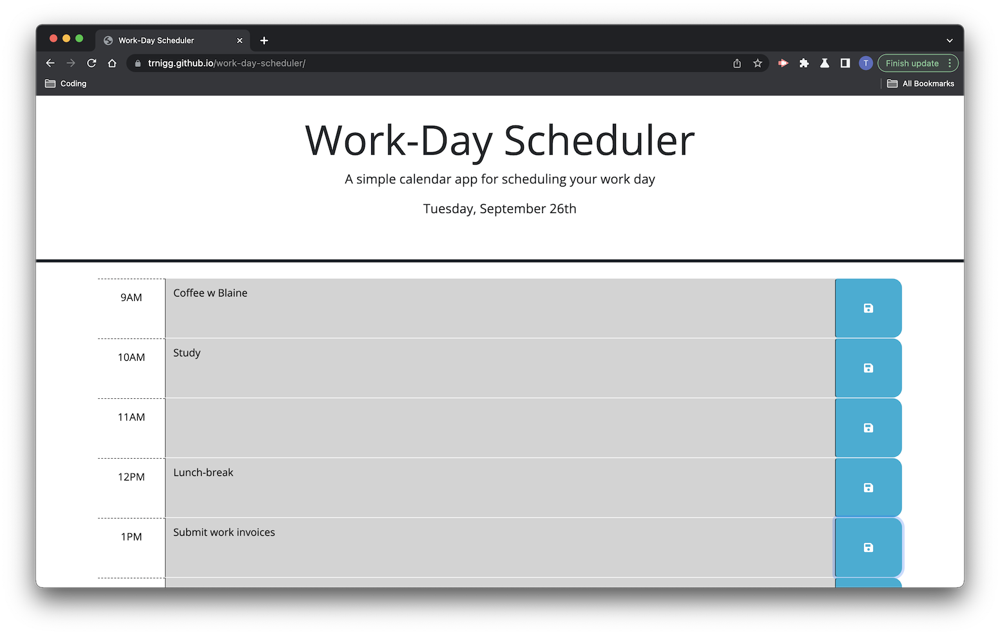
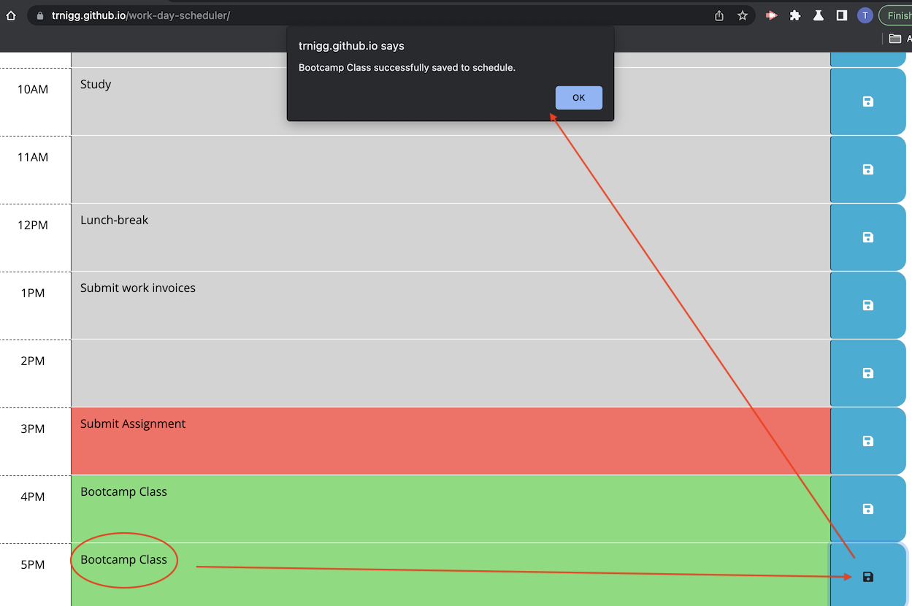
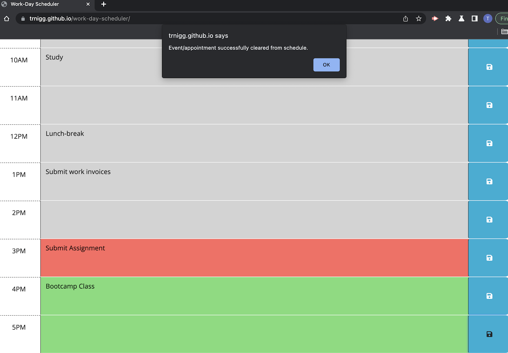

# Work-Day Scheduler
(```work-day-scheduler``` - Module 5 Challenge)

## Description

- The goal of this project was to create a scheduler for working hours (9am-5pm) that allows the user to save events/appointments to their schedule that persist on refreshing/re-loading the page.
- This was achieved by modifying the HTML, CSS, and JavaScript start-code provided, with *Jquery*, and by using *Day.js* api.
- `LocalStorage` was used to allow saved items to persist on refresh, or when the page was closed and reopened at a later date.

## Installation/Usage

1. Please visit the deployed page at: <a href="https://trnigg.github.io/work-day-scheduler/">trnigg.github.io/work-day-scheduler/</a> 
2. Upon loading the web-app, the page will display the current day using ordinal day/month format at the top, and any previously added events will be loaded from `localStorage` and displayed on-screen.



3. The page will dynamically format itself to aid readability - events in the past will be shown with a grey background, the current hour with a red background, and future events with a green background.
4. To save an event to the scheduler:
    - Click on the input area corresponding to the desired time slot;
    - type in the name of the event/appointment;
    - click the blue "save" button.
    - The app will then save the event to `localStorage` and the user will be notified via an alert.



5. To remove an event from the scheduler: 
    - Remove the text from the input area and click the save button again;
    - an alert will notify the user that the event has been removed.



6. Once the page is closed, any event that has been saved will persist upon re-opening of the page.

## Credits

- This project contains starter code in the form of HTML and CSS that was provided as part of coursework. While the HTML has been modified, the CSS has not.
- This project also utilises the *Jquery* 3.4.1 and *Day.js* 1.11.3 (including the *advanceFormat* plugin) APIs for functionality.

## License

- N/A
